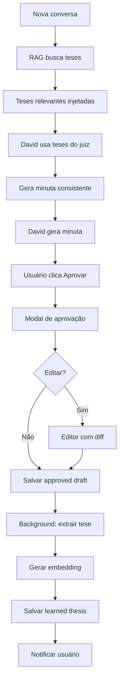

# Plano de Implementação: Sistema de Aprendizado Ativo

## Visão Geral

O sistema de aprendizado ativo permite que o David **aprenda continuamente** com as minutas aprovadas pelo juiz, extraindo teses jurídicas, padrões de redação e fundamentos legais para aplicar em casos futuros similares.

**Objetivo:** Tornar o David progressivamente mais alinhado com o estilo e entendimento jurídico do juiz titular.

---

## Estado Atual (O que já existe)

### ✅ Implementado

#### 1. Schema de Banco de Dados
**Arquivo:** [`drizzle/schema.ts`](file:///Users/henriquefarra/David/David/drizzle/schema.ts#L260-L301)

- `approvedDrafts` - Minutas aprovadas pelo usuário
  - originalDraft, editedDraft
  - approvalStatus (approved, edited_approved, rejected)
  - userNotes para feedback
  
- `learnedTheses` - Teses extraídas automaticamente
  - thesis (ratio decidendi)
  - legalFoundations
  - keywords
  - decisionPattern
  - isObsolete (tese superada)

#### 2. Extração Automática de Teses
**Arquivo:** [`server/thesisExtractor.ts`](file:///Users/henriquefarra/David/David/server/thesisExtractor.ts)

- **Função:** `extractThesisFromDraft()`
- **Método:** LLM com json_schema structured output
- **Extrai:**
  1. Tese firmada (ratio decidendi) - máx 300 palavras
  2. Fundamentos jurídicos (artigos, súmulas)
  3. Palavras-chave (5-10 keywords)
  4. Padrão de redação (estilo, estrutura, tom)

#### 3. Funções de Banco de Dados
**Arquivo:** [`server/db.ts`](file:///Users/henriquefarra/David/David/server/db.ts#L795-L900)

- `createApprovedDraft()` / `getUserApprovedDrafts()`
- `createLearnedThesis()` / `getUserLearnedTheses()`
- `searchSimilarTheses()` - busca por keywords (básica)
- `getLearnedThesisByDraftId()`

#### 4. Integração Parcial no RAG
**Arquivo:** [`server/services/RagService.ts`](file:///Users/henriquefarra/David/David/server/services/RagService.ts#L208-L231)

- Busca teses do usuário durante RAG
- Authority level: 5 (teses do gabinete têm alta prioridade)
- Implementado mas NÃO testado

---

## O que está FALTANDO

### ❌ Não Implementado

1. **Interface de Aprovação de Minutas**
   - Botões "Aprovar", "Aprovar com Edições", "Rejeitar"
   - Modal de edição
   - Campo de notas do usuário

2. **Comando /tese**
   - Listar teses aprendidas
   - Buscar tese específica
   - Marcar tese como obsoleta
   - Visualizar histórico

3. **Busca Semântica de Teses**
   - Embeddings das teses
   - Busca vetorial (não apenas keywords)
   - Ranking por similaridade

4. **Feedback Loop Automático**
   - Trigger após aprovação de minuta
   - Extração automática em background
   - Notificação ao usuário

5. **Analytics de Aprendizado**
   - Dashboard com teses aprendidas
   - Gráfico de evolução
   - Temas mais frequentes

6. **Integração no Prompt**
   - Injetar teses relevantes no contexto
   - Priorizar teses do juiz sobre jurisprudência externa
   - "CENÁRIO A - Memória Encontrada" (já mencionado em engines.ts)

---

## Plano de Implementação

### Fase 1: Interface de Aprovação (Frontend)
**Prioridade:** ALTA  
**Tempo estimado:** 4-6 horas

#### 1.1 Componente DraftApproval
**Arquivo:** `client/src/components/DraftApproval.tsx`

```typescript
interface DraftApprovalProps {
  draftContent: string;
  messageId: number;
  conversationId: number;
}

// Features:
- Botões: Aprovar (✓), Editar e Aprovar (✎✓), Rejeitar (✗)
- Modal de edição com diff viewer
- Campo de notas do usuário
- Loading state durante extração de tese
```

#### 1.2 Integração no MessageBubble
**Arquivo:** `client/src/pages/David.tsx`

- Detectar quando assistente gera minuta (contém "DISPOSITIVO" ou estrutura de sentença)
- Mostrar botão "Aprovar Minuta" abaixo da mensagem
- Abrir modal `DraftApproval` ao clicar

#### 1.3 TRPC Endpoint
**Arquivo:** `server/davidRouter.ts`

```typescript
approveDraft: protectedProcedure
  .input(z.object({
    messageId: z.number(),
    status: z.enum(['approved', 'edited_approved', 'rejected']),
    editedContent: z.string().optional(),
    userNotes: z.string().optional(),
  }))
  .mutation(async ({ input, ctx }) => {
    // 1. Salvar approved draft
    // 2. Trigger extração de tese (background)
    // 3. Retornar sucesso
  });
```

---

### Fase 2: Extração Automática + Embeddings
**Prioridade:** ALTA  
**Tempo estimado:** 3-4 horas

#### 2.1 Background Job para Extração
**Arquivo:** `server/services/ThesisLearningService.ts` (NOVO)

```typescript
class ThesisLearningService {
  async processApprovedDraft(draftId: number) {
    // 1. Buscar draft do banco
    // 2. Chamar extractThesisFromDraft()
    // 3. Gerar embedding da tese
    // 4. Salvar em learnedTheses
    // 5. Retornar tese extraída
  }
  
  async generateThesisEmbedding(thesis: string): Promise<number[]> {
    // Usar modelo de embedding (Google, OpenAI, ou local)
  }
}
```

#### 2.2 Atualizar Schema
**Arquivo:** `drizzle/schema.ts`

```typescript
learnedTheses: {
  // ...campos existentes
  embedding: json("embedding").$type<number[]>(), // ← ADICIONAR
}
```

#### 2.3 Migração de Banco
```sql
ALTER TABLE learnedTheses ADD COLUMN embedding JSON;
```

---

### Fase 3: Comando /tese
**Prioridade:** MÉDIA  
**Tempo estimado:** 3-4 horas

#### 3.1 Implementar comando no backend
**Arquivo:** `server/services/TesisCommandService.ts` (NOVO)

```typescript
async function handleTeseCommand(
  command: string, 
  userId: number
): Promise<string> {
  // /tese list - Listar todas teses
  // /tese search [query] - Buscar tese
  // /tese [id] - Visualizar tese específica
  // /tese obsolete [id] - Marcar como obsoleta
}
```

#### 3.2 Integrar no endpoint de streaming
**Arquivo:** `server/_core/index.ts`

- Detectar comandos que começam com `/tese`
- Chamar `handleTeseCommand()`
- Retornar resposta formatada

#### 3.3 UI do Comando
- Autocomplete para `/tese` no textarea
- Exibir resultados em card especial (não como mensagem normal)
- Botão "Aplicar tese" que insere no contexto

---

### Fase 4: Busca Semântica de Teses
**Prioridade:** MÉDIA  
**Tempo estimado:** 4-5 horas

#### 4.1 Atualizar RagService
**Arquivo:** `server/services/RagService.ts`

```typescript
async searchTheses(
  query: string,
  userId: number,
  options: { limit?: number }
): Promise<RagResult[]> {
  // 1. Gerar embedding da query
  // 2. Buscar teses por similaridade vetorial
  // 3. Misturar resultados exatos (keywords) com semânticos
  // 4. Ordenar por relevância
  // 5. Retornar top N
}
```

#### 4.2 Integração no HybridSearch
- Adicionar `searchTheses()` ao fluxo de busca
- Priorizar teses do usuário (authorityLevel: 5)
- Exibir badge "Tese do Gabinete" na UI

---

### Fase 5: Feedback Loop Completo
**Prioridade:** ALTA  
**Tempo estimado:** 2-3 horas

#### 5.1 Trigger Automático
**Arquivo:** `server/davidRouter.ts` - endpoint `approveDraft`

```typescript
.mutation(async ({ input, ctx }) => {
  const draftId = await createApprovedDraft(...);
  
  // Background job (não esperar)
  ThesisLearningService
    .processApprovedDraft(draftId)
    .catch(err => console.error('Erro ao extrair tese:', err));
  
  return { success: true, draftId };
});
```

#### 5.2 Notificação ao Usuário
- Toast: "✅ Minuta aprovada! Tese sendo extraída..."
- Atualizar lista de teses em tempo real (websocket ou polling)

---

### Fase 6: Integração no Prompt (Motor B - Memória)
**Prioridade:** ALTA  
**Tempo estimado:** 3-4 horas

#### 6.1 Atualizar ContextBuilder
**Arquivo:** `server/services/ContextBuilder.ts`

```typescript
async injectLearnedTheses(
  userId: number, 
  query: string
): Promise<this> {
  const theses = await RagService.searchTheses(query, userId, { limit: 3 });
  
  if (theses.length > 0) {
    const thesesContext = `
## TESES DO GABINETE (Memória do Juiz Titular)

**INSTRUÇÃO CRÍTICA:** As teses abaixo foram firmadas pelo juiz titular em casos anteriores. 
Elas têm PRIORIDADE ABSOLUTA sobre jurisprudência externa. Respeite a "caneta do juiz".

${theses.map((t, i) => `
### Tese ${i + 1}: ${t.title}
**Ratio Decidendi:** ${t.content}
**Fundamentos:** ${t.legalFoundations}
**Aplicável em:** ${t.keywords}
`).join('\n')}

**CENÁRIO A - Memória Encontrada:** Ignore  jurisprudência divergente. A tese do juiz é soberana.
`;
    
    this.addSection('LEARNED_THESES', thesesContext);
  }
  
  return this;
}
```

#### 6.2 Atualizar createBuilderForIntent
```typescript
if (intent === 'DRAFT' && motors.includes('B')) {
  await builder.injectLearnedTheses(userId, userQuery);
}
```

---

### Fase 7: Analytics (Opcional)
**Prioridade:** BAIXA  
**Tempo estimado:** 6-8 horas

#### 7.1 Dashboard de Aprendizado
**Arquivo:** `client/src/pages/LearningDashboard.tsx`

- Gráfico: Teses aprendidas por mês
- Nuvem de palavras-chave
- Temas mais frequentes
- Taxa de aprovação de minutas

#### 7.2 Endpoint de Analytics
```typescript
getLearningStats: protectedProcedure
  .query(async ({ ctx }) => {
    // Estatísticas agregadas
  });
```

---

## Arquitetura do Fluxo Completo



---

## Priorização (Ordem de Implementação)

### Sprint 1 (Essencial - 1-2 dias)
1. ✅ Interface de aprovação (Fase 1)
2. ✅ Extração automática + embeddings (Fase 2)
3. ✅ Feedback loop (Fase 5)

### Sprint 2 (Core - 1 dia)
4. ✅ Integração no Prompt - Motor B (Fase 6)
5. ✅ Busca semântica (Fase 4)

### Sprint 3 (Features - 1 dia)
6. ✅ Comando /tese (Fase 3)
7. ⚠️ Analytics (Fase 7) - opcional

---

## Riscos e Mitigações

| Risco | Impacto | Mitigação |
|-------|---------|-----------|
| Extração de tese falha | Alto | Retry + fallback manual |
| Embedding muito lento | Médio | Background job + cache |
| Teses irrelevantes | Alto | Filtro por similaridade > 0.5 |
| Usuário não aprova minutas | Crítico | Onboarding + UX clara |

---

## Métricas de Sucesso

- **Adoção:** 50%+ das minutas aprovadas
- **Precisão:** 80%+ de teses extraídas corretamente
- **Reuso:** 30%+ de novas minutas usam teses aprendidas
- **Tempo:** Extração de tese < 5 segundos

---

## Próximos Passos Imediatos

1. ✅ Criar `client/src/components/DraftApproval.tsx`
2. ✅ Adicionar endpoint `approveDraft` no TRPC
3. ✅ Implementar `ThesisLearningService.ts`
4. ✅ Atualizar schema com campo `embedding`
5. ✅ Testar fluxo completo end-to-end

---

## Documentação Relacionada

- [thesisExtractor.ts](file:///Users/henriquefarra/David/David/server/thesisExtractor.ts) - Extração atual
- [engines.ts](file:///Users/henriquefarra/David/David/server/prompts/engines.ts#L50) - Menção "CENÁRIO A - Memória Encontrada"
- [RagService.ts](file:///Users/henriquefarra/David/David/server/services/RagService.ts#L208) - Integração RAG atual

---

**Status:** 🟡 PARCIALMENTE IMPLEMENTADO (Backend 60%, Frontend 0%)  
**Prioridade:** 🔴 CRÍTICA (Feature principal do produto)
