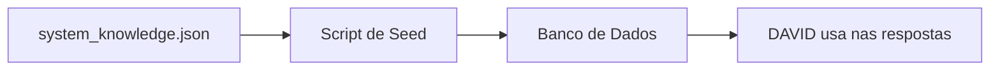
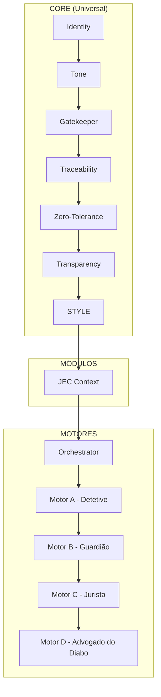

# Walkthrough: Implementações da Sessão

## Resumo Executivo

Esta sessão implementou três componentes principais:
1. **CORE_STYLE** - Manual de Redação Judicial integrado
2. **Preferências de Estilo** - Campo personalizável na UI
3. **Base de Conhecimento Seed** - Conteúdo pré-carregado do sistema

---

## 1. CORE_STYLE (Manual de Redação)

### O que é?
Um conjunto de regras de escrita que o DAVID segue automaticamente ao redigir minutas.

### Onde está?
[core.ts](file:///Users/henriquefarra/David/David/server/prompts/core.ts) (linhas 93-127)

### Regras incluídas:
| Regra | Descrição |
|-------|-----------|
| Tom e Técnica | Impessoalidade, objetividade, precisão |
| Postura | Age como quem decide |
| Replicação de DNA | Copia estilo da base (com fallback) |
| Formatação | Parágrafos coesos, evita bullets |
| Destaque | NEGRITO para pontos importantes |

---

## 2. Preferências de Estilo do Gabinete

### O que é?
Campo editável na UI onde o usuário pode adicionar preferências de vocabulário e estilo.

### O que mudou?
| Antes | Depois |
|-------|--------|
| "Instruções do DAVID" | "Preferências de Estilo do Gabinete" |
| Substituía todo o prompt | Apenas concatena ao final |
| Texto padrão fixo | Placeholder ghost com exemplos |

### Como funciona:
- Campo abre **vazio** por padrão
- Exemplos aparecem em **texto fantasma** (translúcido)
- Ao digitar, o placeholder desaparece
- Conteúdo é **adicionado** ao prompt, não substitui

### Arquivo alterado:
[Configuracoes.tsx](file:///Users/henriquefarra/David/David/client/src/pages/Configuracoes.tsx)

---

## 3. Base de Conhecimento Seed

### O que é?
Sistema para pré-carregar conteúdo jurídico (Súmulas, Enunciados, Teses) que o DAVID já conhece desde o início.

### Arquitetura:



### Arquivos criados:

| Arquivo | Função |
|---------|--------|
| [system_knowledge.json](file:///Users/henriquefarra/David/David/server/data/system_knowledge.json) | Arquivo mestre (editar aqui) |
| [seed-knowledge.ts](file:///Users/henriquefarra/David/David/scripts/seed-knowledge.ts) | Script de sincronização |

### Alterações no banco:
- Campo `systemId` (varchar 100) para controle de upsert
- Tipos `sumula` e `tema_repetitivo` adicionados
- Index para performance

### Como usar:

```bash
# 1. Editar o arquivo JSON
# 2. Rodar o comando:
pnpm run seed:knowledge
```

### Output do script:
```
🌱 Semeadura concluída!
   ✅ Criados: X
   🔄 Atualizados: Y
   💤 Ignorados: Z
```

---

## Arquitetura Completa do DAVID



---

## Commits Realizados

| Hash | Descrição |
|------|-----------|
| ff23d0a | Placeholder ghost para preferências |
| 121992e | Base de Conhecimento Seed |
| 5b496c6 | Fix: getDb() no script |
| 2613dff | Fix: ESM imports |
| 4ae054a | Fix: Referência de tipos Node.js |

---

## Próximos Passos

- [ ] Proteção na UI (ocultar delete para `source = 'sistema'`)
- [ ] Popular JSON com Súmulas STJ reais
- [ ] Comando `/analise`
- [ ] Comando `/minutar`
- [ ] Comando `/tese`
